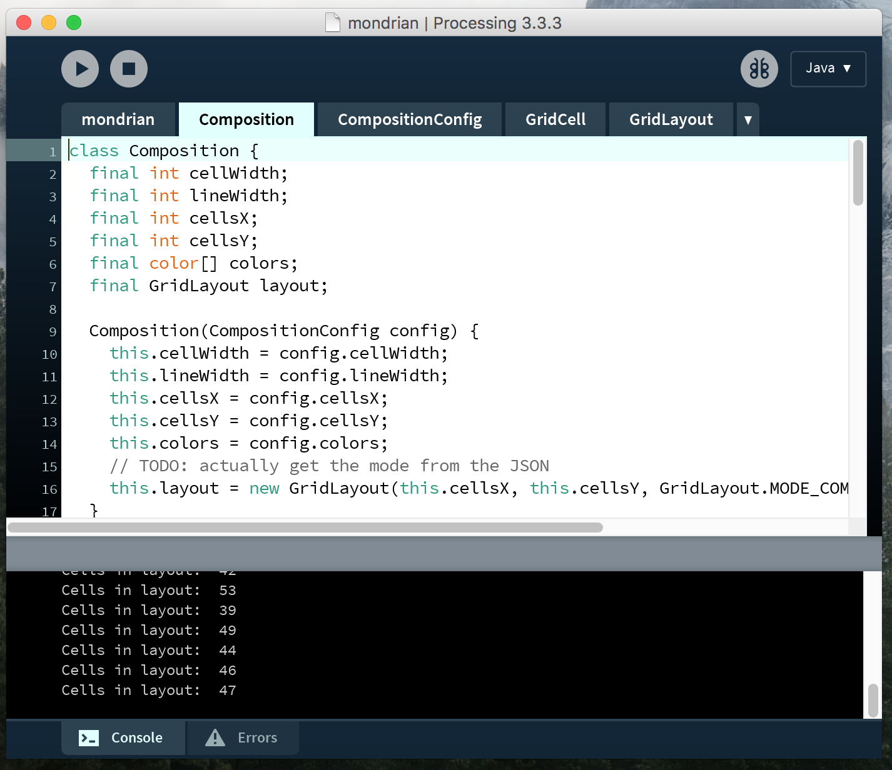
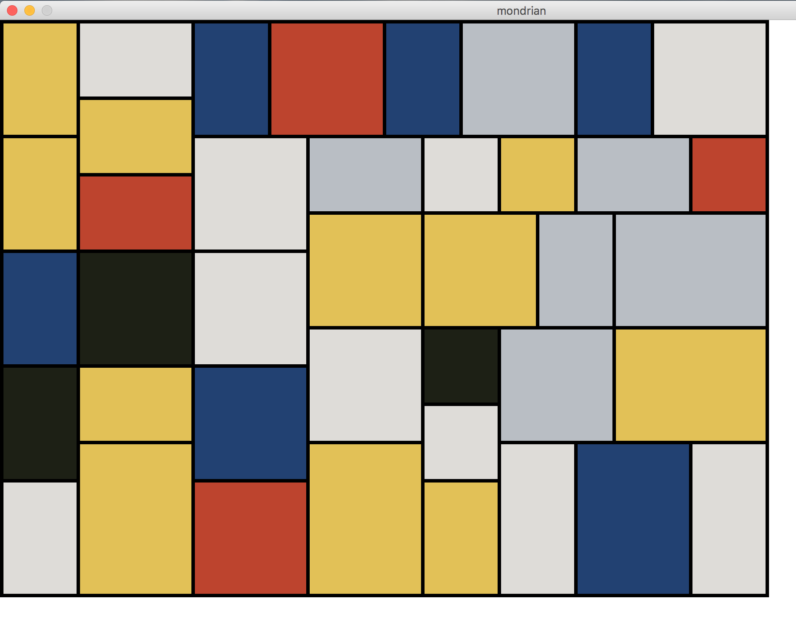
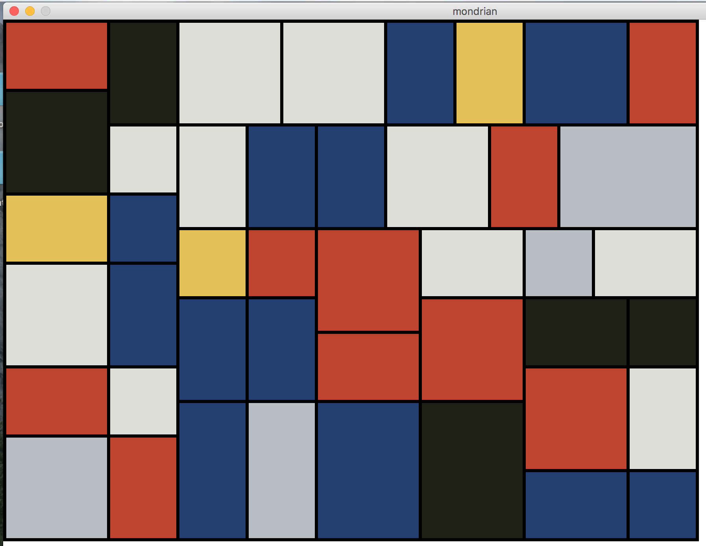
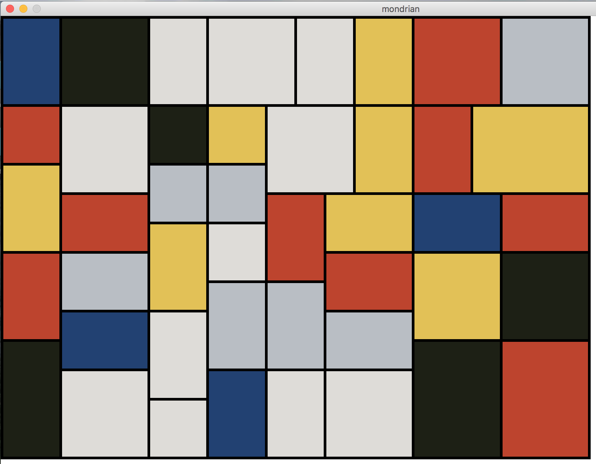
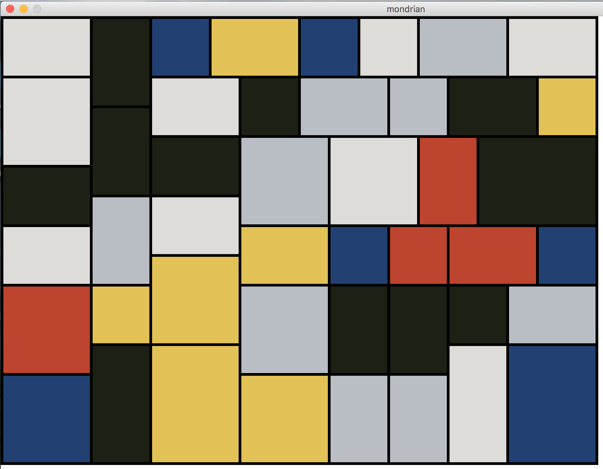
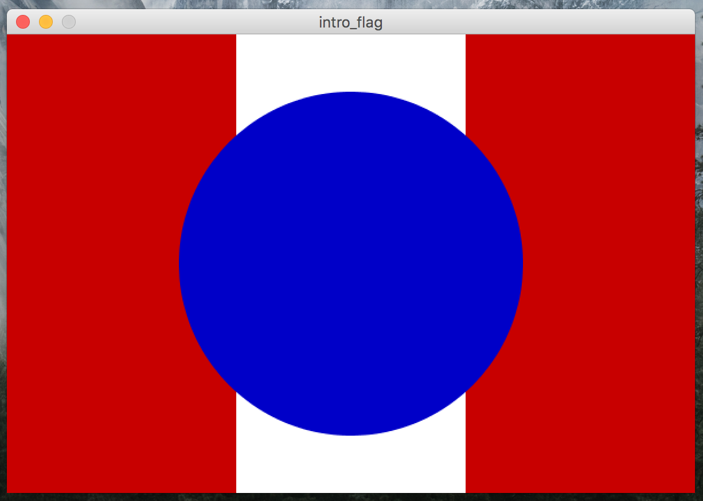
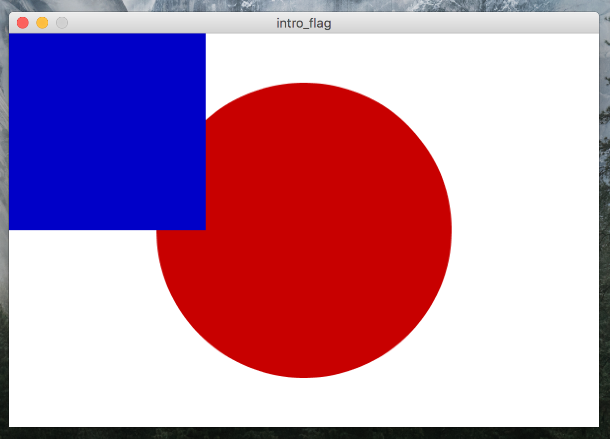

# Processing

Make graphics with code!

---

## Example: Modern art

---

## Write code...

---

## The code turns into pictures!

---

---

---

### By the end of the course, you will know how to create this!

---

## Simpler example...

---

## Flag for an imaginary country

---

## We have a headstart!

---

## Download the starting code

1. Go to https://github.com/UtahRETC/ProgrammingIntroClass
2. Click "Clone or download"
3. Click "Download ZIP"
4. Extract contents
5. Navigate to "projects" -> "flag"

---

## The Processing Reference

https://processing.org/reference/

