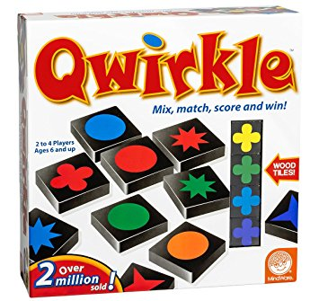
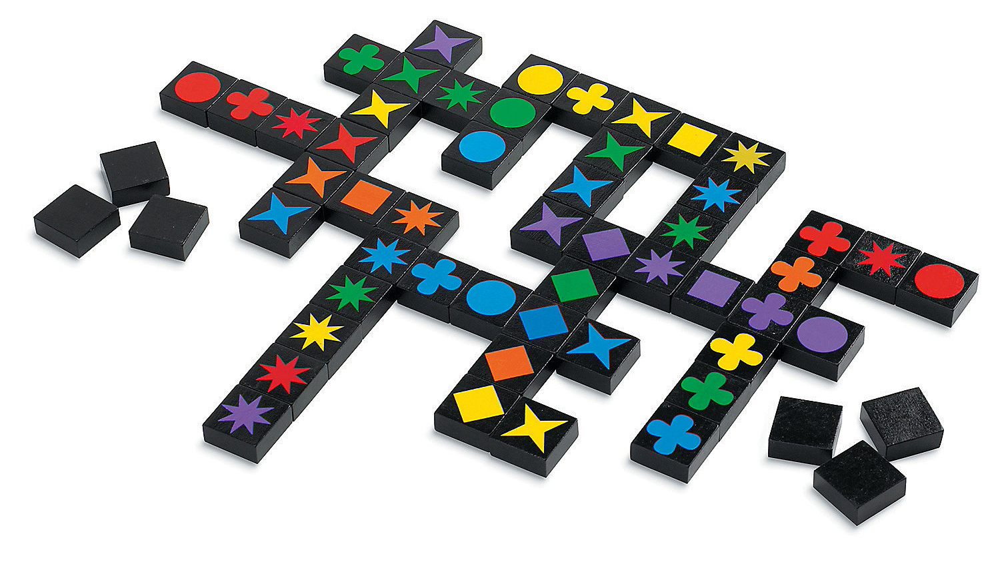
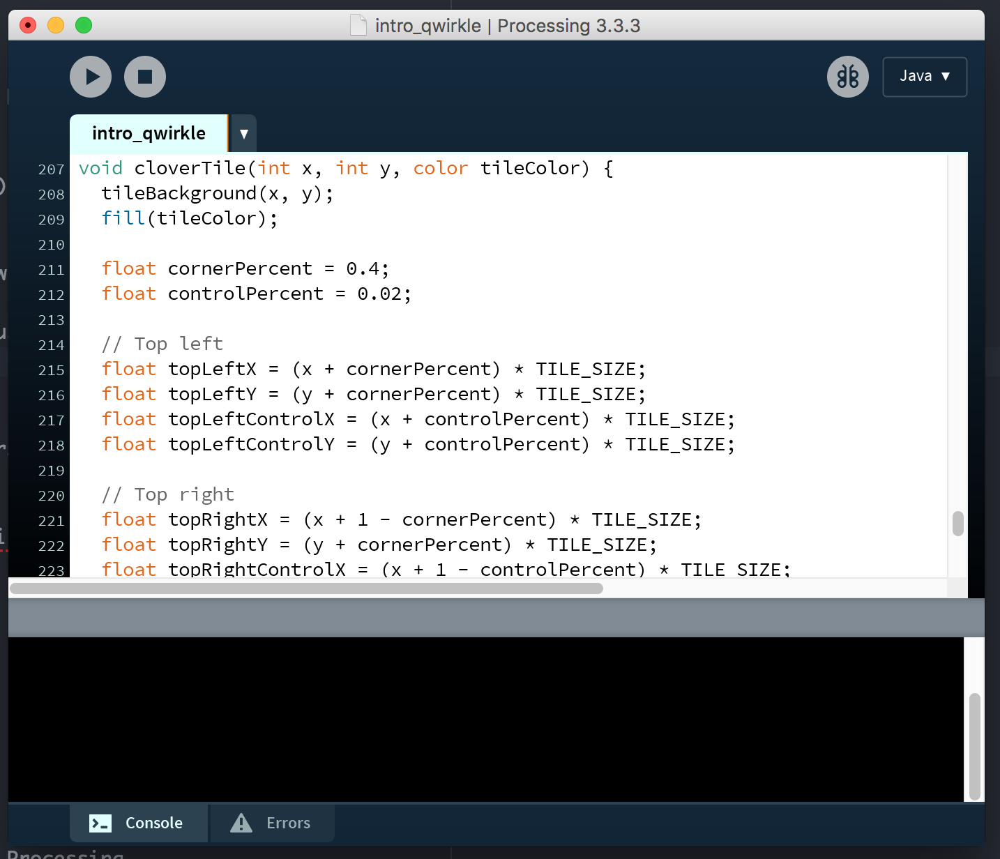
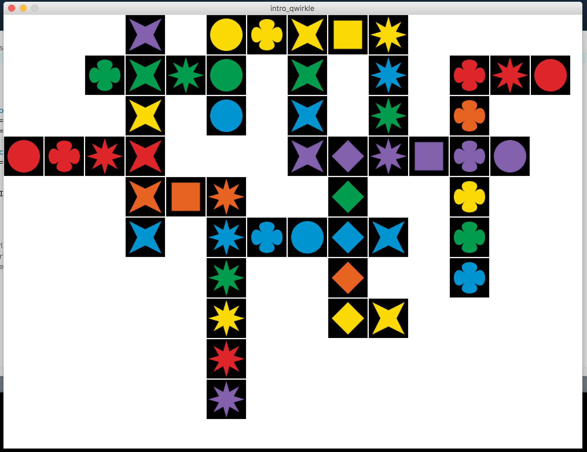
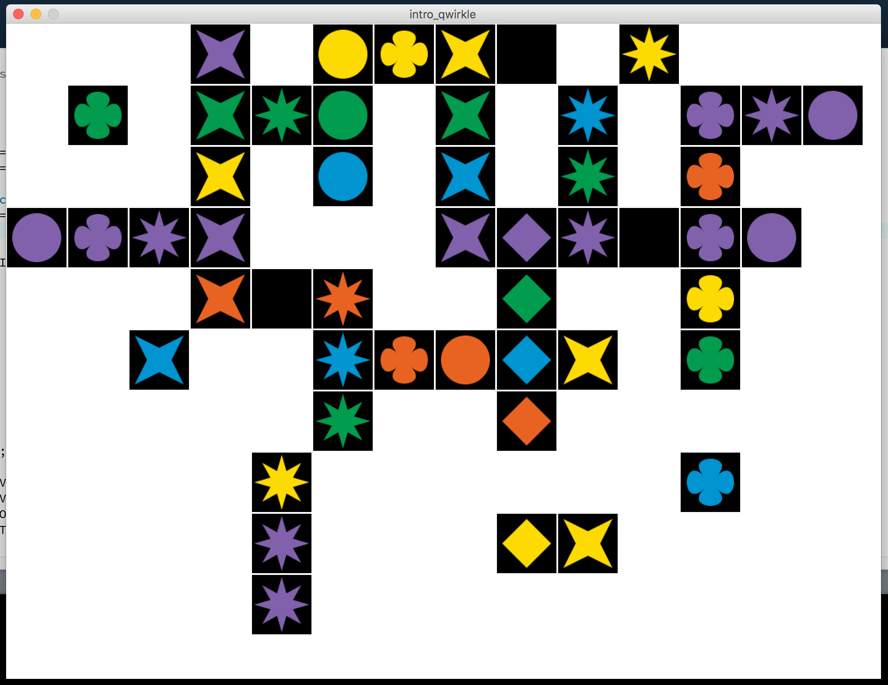
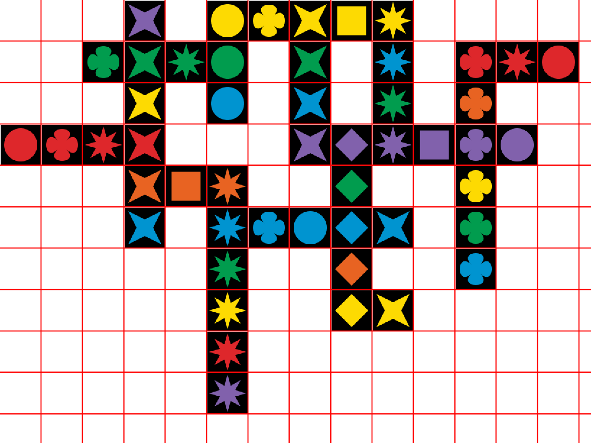
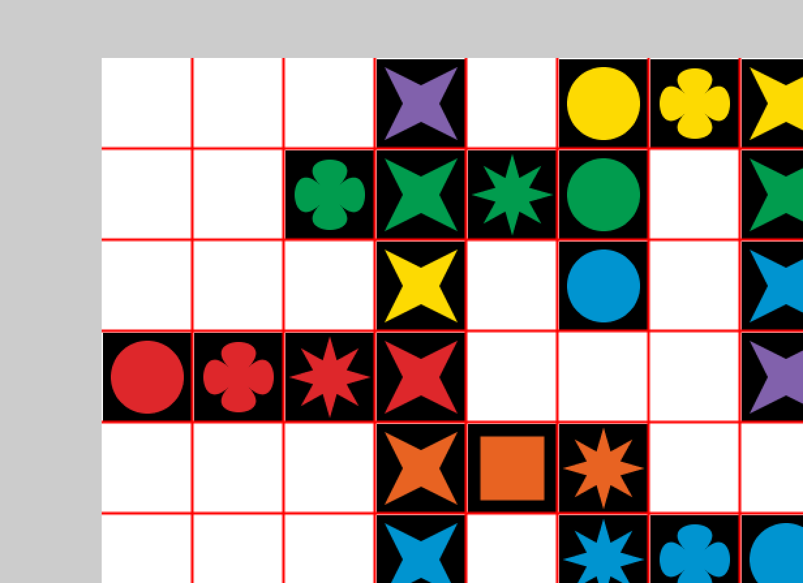
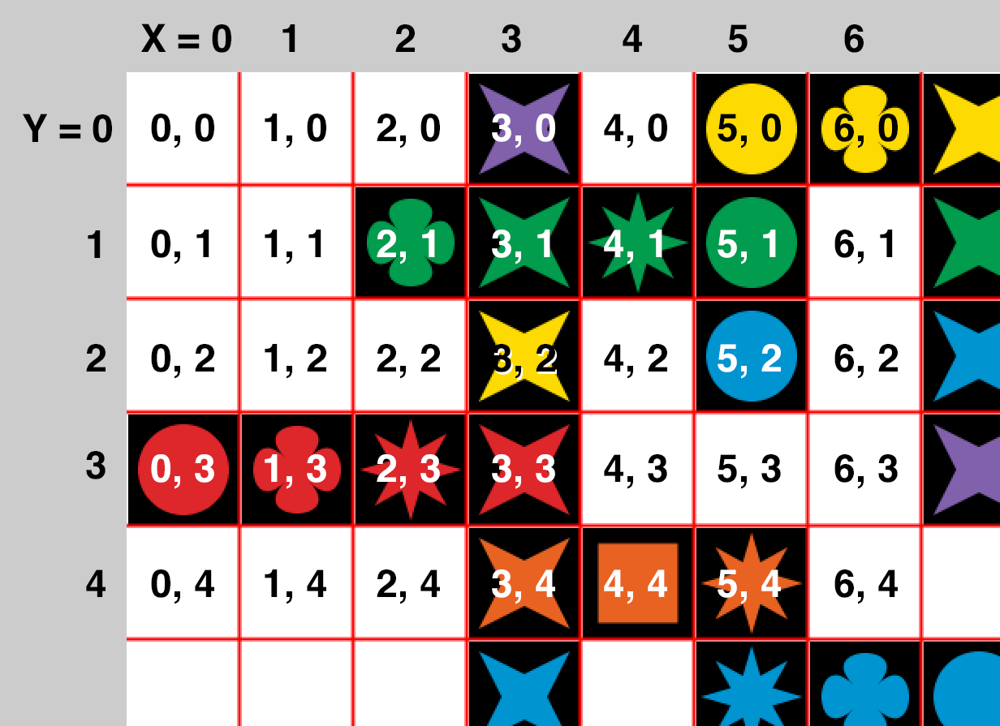
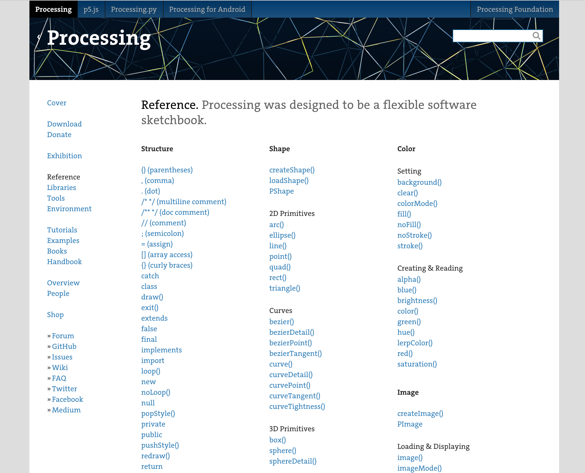

# Processing, part 2: Qwirkle

---

## Children's game



---

## Painted wooden tiles, arranged in lines




---

## Write some code...



---

## Draw a Qwirkle board!



---


---

## Here is what we have to start:



---

## Download the starting code

1. Go to https://github.com/UtahRETC/ProgrammingIntroClass
2. Click "Clone or download"
3. Click "Download ZIP"
4. Extract contents
5. Navigate to "projects" -> "flag"

---

## Homework Challenges

1. Put the tiles in the right places
2. Use the correct colors
3. Add the color `RED` and make the right tiles red
4. Put square tiles on the board

---

## When your picture looks like this, you have completed all the challenges!


---

## How will we do it?

---

## Idea #1: Grid coordinates

---


---



---



---



```java
starTile(4, 1, GREEN);

circleTile(5, 0, YELLOW);
```

---

## Idea #2: Variables

---

## Example: The `GREEN` variable saves information about color

```java
// ...

final color YELLOW = color(253, 218, 2);
final color GREEN = color(1, 156, 78);
final color BLUE = color(0, 148, 208);

// ...

starTile(4, 1, GREEN);
```

---

## Challenge: Add the color `RED` and make the right tiles red

Hint: You will define the variable like this:

```java
final color RED = color(/* Put color info here */);
```

And you will use the variable like this:

```java
circleTile(0, 3, RED);
```

---

## Idea #3: Functions

---

## We can use pre-made functions

```java
rect(0, 0, 200, 400)
```

---

## We can also make our own functions!

```java
void circleTile(int x, int y, color tileColor) {
  tileBackground(x, y);
  fill(tileColor);
  float cx = (x + 0.5) * TILE_SIZE;
  float cy = (y + 0.5) * TILE_SIZE;
  float radius = TILE_SIZE * 0.8;
  ellipse(cx, cy, radius, radius);
}
```

---

## Challenge: Put square tiles on the board

```java
void squareTile(int x, int y, color tileColor) {
  tileBackground(x, y);
  fill(tileColor);

  // TODO: put your code for square tiles here!
  // Look at the circleTile function for a hint
}
```

---

## Other ideas

- Look for patterns

- Try changing a number or a word

- Don't be afraid to make a mistake!

---

## The Processing Reference

https://processing.org/reference/



---

## Turning in your homework:

- Email uretcjava@gmail.com

- Include your full name

- Send your code as an attachment
